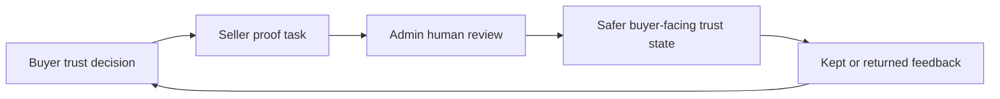
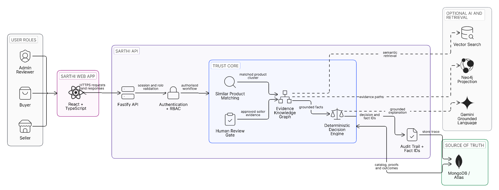

<div align="center">
  <h1>Sarthi</h1>
  <p><strong>Evidence-driven commerce trust for orders buyers actually keep.</strong></p>
  <p>
    National hackathon prototype for Meesho-style marketplace trust decisions:
    compare similar listings, verify proof, guide checkout, learn from outcomes.
  </p>

  <p>
    <a href="https://sarthi-kd3t1m4gr-kanikas-projects-ebdc9299.vercel.app/"><strong>Live Demo</strong></a>
    |
    <a href="./docs/DEMO_SCRIPT.md">Demo Script</a>
    |
    <a href="./docs/JUDGE_REVIEW_GUIDE.md">Judge Guide</a>
    |
    <a href="./docs/ARCHITECTURE.md">Architecture</a>
  </p>

  <p>
    
    
    
    
    
    
  </p>
</div>

---

## The Problem

Marketplace buyers often compare many near-identical listings without knowing which seller, size, offer, review signal, proof asset, or payment mode to trust. That guesswork creates avoidable returns, refund friction, COD risk, and seller support load.

Sarthi is built around one rule:

> Evidence before recommendation.

When evidence is strong, Sarthi helps the buyer move forward. When evidence is weak, it asks for proof, suggests a safer action, or pauses the recommendation.

## Live Demo

| Artifact | Link |
| --- | --- |
| Deployed prototype | [Open Sarthi](https://sarthi-kd3t1m4gr-kanikas-projects-ebdc9299.vercel.app/) |
| Demo script | [docs/DEMO_SCRIPT.md](./docs/DEMO_SCRIPT.md) |
| Judge review guide | [docs/JUDGE_REVIEW_GUIDE.md](./docs/JUDGE_REVIEW_GUIDE.md) |
| Architecture notes | [docs/ARCHITECTURE.md](./docs/ARCHITECTURE.md) |

## What Sarthi Does



| Role | Experience | Impact |
| --- | --- | --- |
| Buyer | Feed, similar-listing comparison, SKU Trust Passport, Size Oracle, proof graph, offer check, checkout confidence, orders, privacy controls. | Less confusion before checkout and fewer avoidable returns. |
| Seller | Evidence console, proof tasks, document upload, listing drafts, measurement correction, admin status. | Clear actions to improve trust without seeing buyer private memory. |
| Admin reviewer | Review Desk, AI Triage, Risk & Policy, Work Saved, seller dossiers, proofs, documents, drafts, audit events. | Less manual reading, cleaner routing, final decisions still human-in-loop. |

## Core Features

| Area | Implemented functionality |
| --- | --- |
| Buyer feed | Marketplace-style browsing with product images, seller, rating, delivery, search, categories, trust states, wishlist, orders, and proof ledger. |
| Confusion Resolver | Compares similar listings by seller trust, SKU outcomes, fit, reviews, price value, proof coverage, offer truth, and uncertainty. |
| SKU Trust Passport | Shows delivered evidence, return risk, seller verification, source health, proof gaps, and traceable fact IDs. |
| Size Oracle | Uses buyer-controlled fit memory plus category and SKU evidence to recommend safer size choices. |
| Galti Mat Dohrao | Surfaces one avoidable issue, such as fabric, color, fit, dispatch, or missing proof. |
| Offer Sach Check | Checks price history, campaign state, inventory pressure, and timer resets before checkout. |
| Checkout Confidence | Recommends COD or prepaid only when evidence supports it, then stores an expectation contract. |
| Outcome Learning | Kept, returned, exchanged, RTO, and correction flows improve future guidance safely. |
| Seller Evidence Loop | Sellers upload proofs, submit verification documents, create drafts, and track review state. |
| Admin Review | Reviewer approves, rejects, or requests revision for applications, documents, proofs, and drafts. |
| Auditability | Decisions carry tools used, fact IDs, timestamps, graph paths, and unsupported-claim blocking. |

## Agentic AI Layer

Sarthi uses agentic AI as tool orchestration, not blind automation.

| Capability | How it works |
| --- | --- |
| Buyer question routing | Detects compare, fit, fabric, seller, offer, checkout, and return intents. |
| Grounded retrieval | Pulls product, seller, SKU, proof, source-health, and graph context before answering. |
| Gemini assistance | Generates concise grounded language when `GEMINI_API_KEY` is configured. |
| Evidence graph | Connects seller, SKU, returns, reviews, offer, proof, buyer-fit context, and final trust score. |
| Admin triage | Summarizes risk, SLA, buyer impact, source checks, and suggested reviewer route. |
| Fallback behavior | If Gemini, Vector Search, or Neo4j is unavailable, deterministic services keep the prototype usable. |

AI cannot approve sellers, publish listings, invent product facts, bypass verification gates, or expose buyer private fit memory to sellers.

## Evaluation Readiness

| Requirement | Where it is covered |
| --- | --- |
| Working prototype | Live demo, seeded accounts, API-backed buyer, seller, admin, checkout, review, and outcome flows. |
| Code quality and architecture | Split React frontend, Fastify API, service modules, tests, architecture docs, and runtime setup. |
| Usability and UX | Role-specific workspaces with a clear demo path, not a single mocked screen. |
| Completeness | Full loop from buyer comparison to seller proof, admin review, checkout guidance, and kept-order learning. |
| Project core | Problem, solution, agentic AI layer, and business impact are covered in this README and [docs/PRD.md](./docs/PRD.md). |
| Live deployment | Public demo link is at the top; judges can test workflows and model-assisted responses directly. |
| Code and setup | Local setup, environment, seed, run, and verification commands are listed below. |
| Open-source attribution | Main libraries, licenses, roles, and external services are documented in [docs/ATTRIBUTION.md](./docs/ATTRIBUTION.md). |

## Demo Accounts

| Role | Username | Password |
| --- | --- | --- |
| Buyer | `asha.buyer` | `buyer-asha-pass` |
| Seller | `seller.a` | `seller-a-pass` |
| Admin reviewer | `reviewer.admin` | `admin-reviewer-pass` |

## Recommended Demo Path

1. Sign in as `asha.buyer`.
2. Open the Shop feed and run a Safety Check on a Sarthi-eligible product.
3. Open proof details and inspect the Evidence Graph.
4. Open product detail to show SKU Trust Passport, Size Oracle, and Galti Mat Dohrao.
5. Continue to checkout and show Offer Sach Check plus COD/prepaid guidance.
6. Sign in as `seller.a` and show proof tasks, evidence coach, documents, and listing drafts.
7. Sign in as `reviewer.admin` and show Review Desk, AI Triage, Risk & Policy, Work Saved, and reviewer actions.

For a timed voiceover, use [docs/DEMO_SCRIPT.md](./docs/DEMO_SCRIPT.md).

## Architecture

<p align="center">
  
</p>

Sarthi separates the user-facing React app from the Fastify API, role validation, trust core, evidence graph, deterministic decision engine, optional AI retrieval, and MongoDB/Atlas source of truth. AI assists retrieval and explanation; the deterministic trust layer and human review gate remain responsible for decisions.

| Layer | Stack |
| --- | --- |
| Frontend | React 19, TypeScript, Vite, React Router, Lucide icons |
| Backend | Node.js, Fastify, TypeScript |
| Database | MongoDB local or MongoDB Atlas |
| AI | Optional Gemini grounded generation and embeddings |
| Retrieval | Optional Atlas Vector Search or local cosine fallback |
| Graph | Optional Neo4j projection with MongoDB-backed fallback |
| Tests | Node test runner and Playwright E2E |

## Run Locally

### Prerequisites

- Node.js 20+
- npm 10+
- MongoDB local or MongoDB Atlas
- Optional: Gemini API key
- Optional: Neo4j

### 1. Clone and install

```powershell
git clone https://github.com/kanikaa-3018/Sarthi.git
cd Sarthi
npm --prefix apps/api install
npm --prefix frontend install
```

### 2. Configure the API

```powershell
Copy-Item .env.example apps\api\.env
```

For a local MongoDB demo, these values are enough:

```env
PORT=8000
MONGODB_URI=mongodb://127.0.0.1:27017
MONGODB_DB=sarthi
DEMO_CONTROLS_ENABLED=true
```

Optional Gemini:

```env
LLM_PROVIDER=gemini
LLM_MODEL=gemini-3.1-flash-lite
GEMINI_API_KEY=<your-key>
```

### 3. Seed and start the backend

```powershell
npm --prefix apps/api run seed
npm run dev:api
```

Backend health:

```text
http://127.0.0.1:8000/health
```

### 4. Start the frontend

```powershell
npm run dev:frontend
```

Open:

```text
http://localhost:5173
```

The frontend proxies `/api` requests to the Fastify server on port `8000`.

## Verification

```powershell
npm run build:test
npm run e2e
npm run gemini:smoke
```

Individual checks:

```powershell
npm --prefix apps/api run build
npm --prefix apps/api run test
npm --prefix frontend run build
```

## Repository Map

```text
Sarthi/
  apps/api/        Fastify API, services, routes, seed data, tests
  frontend/        React app for buyer, seller, admin, checkout, trust UI
  docs/            Product, architecture, privacy, demo, and judge notes
  scripts/         Local setup helpers
  .env.example     Runtime configuration template
```

## Documentation

| Document | Purpose |
| --- | --- |
| [docs/PRD.md](./docs/PRD.md) | Product scope, users, modules, requirements, success metrics. |
| [docs/ARCHITECTURE.md](./docs/ARCHITECTURE.md) | Runtime architecture, routes, data model, AI boundaries. |
| [docs/TRUST_DATA_AND_PRIVACY.md](./docs/TRUST_DATA_AND_PRIVACY.md) | Evidence model, trust states, privacy and edge cases. |
| [docs/JUDGE_REVIEW_GUIDE.md](./docs/JUDGE_REVIEW_GUIDE.md) | Review path, accounts, checks, and rubric mapping. |
| [docs/DEMO_SCRIPT.md](./docs/DEMO_SCRIPT.md) | Presentation flow for a recorded demo. |
| [docs/PRODUCT_READINESS.md](./docs/PRODUCT_READINESS.md) | What works today and what production still needs. |
| [docs/ATTRIBUTION.md](./docs/ATTRIBUTION.md) | Main packages, versions, licenses, roles, and external services. |

<details>
  <summary><strong>Prototype disclosure</strong></summary>

This project uses deterministic seeded commerce data for evaluation. It is suitable for testing the product logic, role-based workflows, auditability, and UI flow. It is not connected to live marketplace orders, payments, KYC, logistics, or production document storage.

Production use would require official marketplace connectors, managed identity, secure media storage, reviewer operations, observability, retention policy, rate limits, accessibility QA, and AI governance.

</details>

## Security And Privacy Boundaries

- Buyer private fit memory is buyer-only.
- Sellers see aggregate evidence and owned listing tasks, not private buyer memory.
- Admin reviewers see seller applications, documents, proofs, drafts, risk, source health, and audit context.
- AI output is grounded in retrieved facts and falls back deterministically.
- Secrets belong in `.env`; do not commit API keys, database credentials, documents, or real user data.

## License

No open-source license has been published yet. Add a `LICENSE` file before accepting external production contributions.
