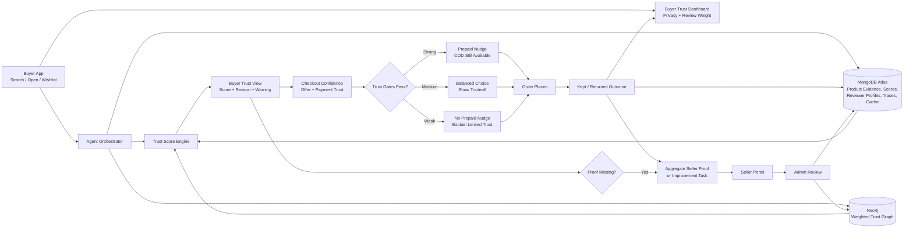
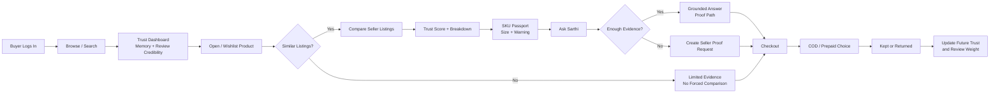

# Sarthi Flowchart And HLD

This document contains three left-to-right flowcharts that fit better on A4 landscape pages.

The goal is to show Sarthi as a closed-loop product without making the diagram too tall or crowded.

## 1. Entire Closed-Loop System

## 2. Buyer Flow

## 3. Seller And Admin Flow

```mermaid
flowchart LR
    Seller[Seller Applies] --> Docs[Upload Verification Docs]
    Docs --> AdminReview[Admin Reviews Seller]
    AdminReview --> Approved{Approved?}

    Approved -- No --> Revision[Revision / Rejection]
    Revision --> Docs

    Approved -- Yes --> Draft[Create Listing Draft]
    Draft --> ListingReview[Admin Reviews Listing]
    ListingReview --> Published[Published With<br/>Limited Evidence]

    Published --> BuyerSignals[Buyer Questions<br/>Returns + Reviews]
    BuyerSignals --> Aggregate[Aggregate Signals Only<br/>No Buyer Identity]
    Aggregate --> Coach[Seller Evidence Coach]

    Coach --> Action[Seller Adds Proof<br/>or Fixes Listing]
    Action --> ProofReview[Admin / Rules Validate]
    ProofReview --> Update[Update SKU Trust<br/>and Graph Evidence]
    Update --> FutureBuyer[Future Buyers See<br/>Stronger Proof]
```

## 4. Reading The Diagram

- The buyer receives a simple trust decision, not a technical report.
- MongoDB Atlas stores flexible product evidence, scores, traces, checkout sessions, proof requests, and cache.
- Buyer review profiles downweight reviews from very new, high-return, high-RTO, or repeated-pattern accounts.
- Neo4j stores weighted relationships for graph reasoning.
- Seller tasks are aggregate and privacy-safe.
- Admin review prevents trust from being self-declared.
- Delivery outcomes update future recommendations.
